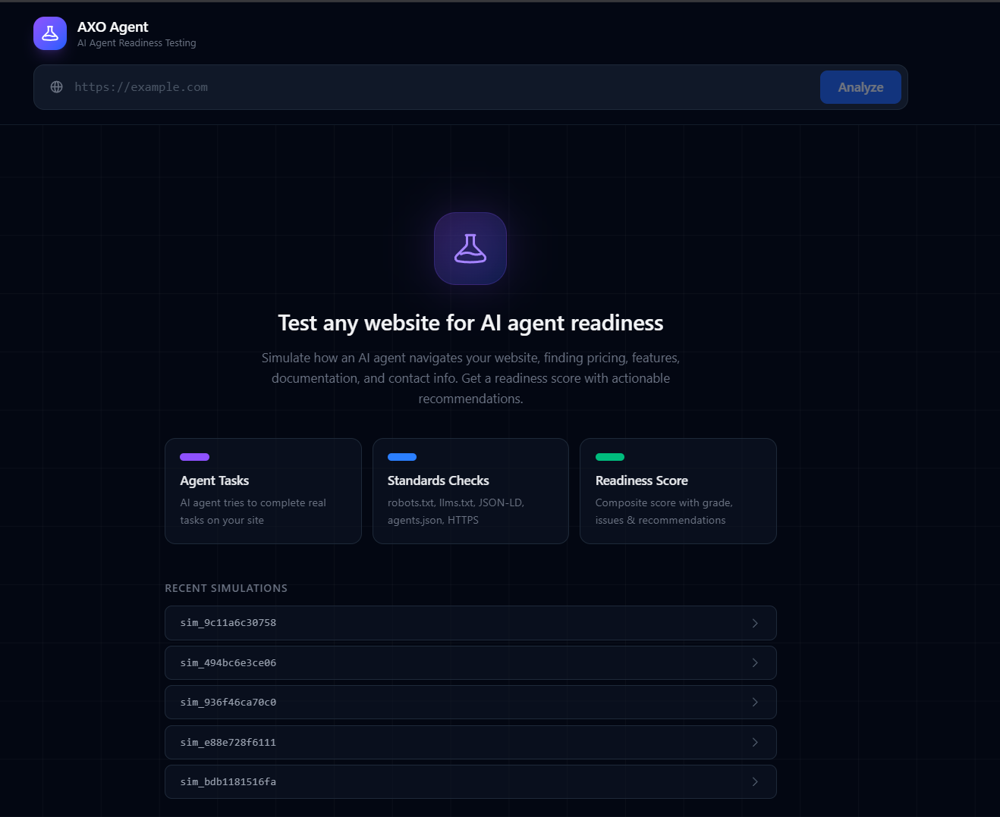
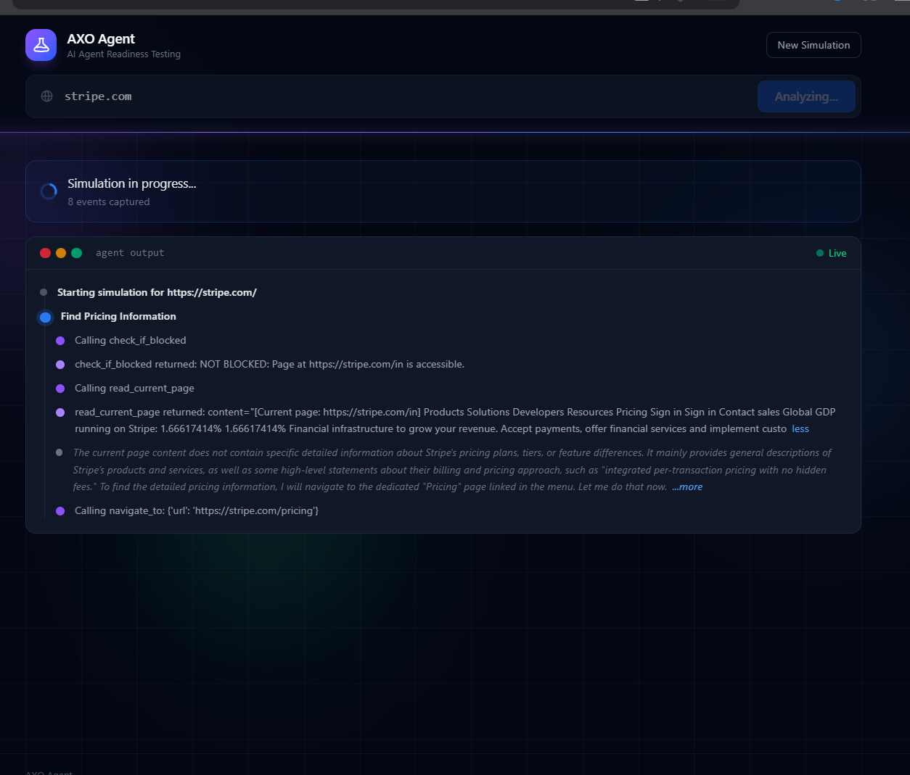
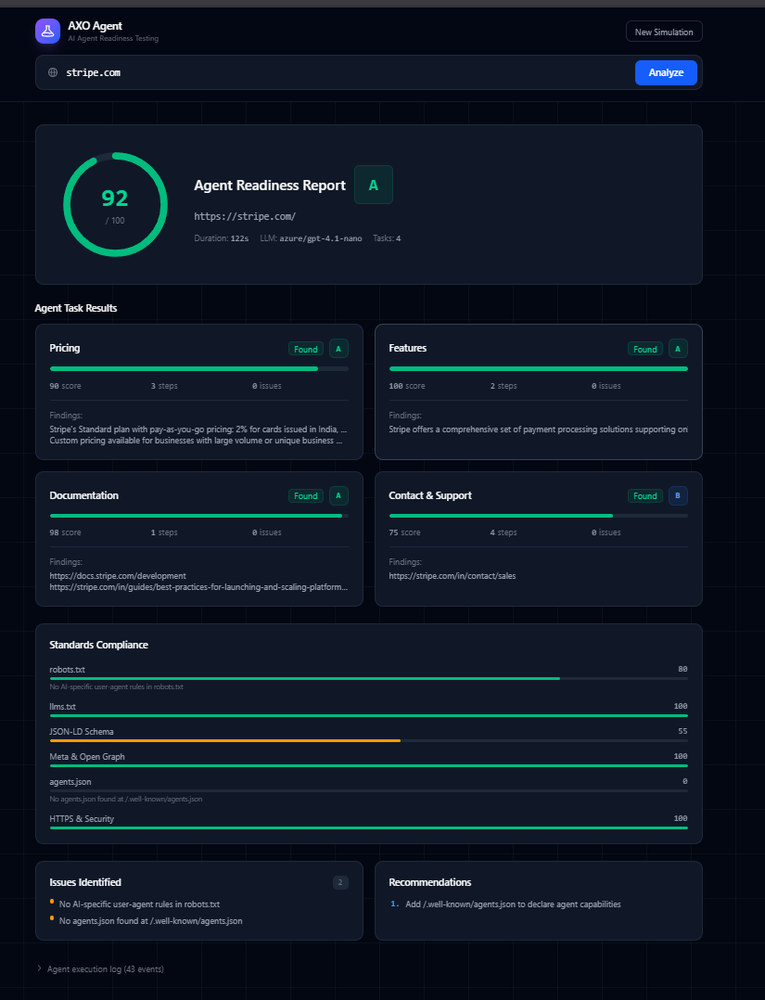

# AXO Agent

A tool that tests how AI-ready a website is by sending an autonomous agent to navigate it. The agent tries to find pricing, features, documentation, and contact information - then produces a readiness score based on what it found and how well the site follows emerging AI standards.



## How It Works

The simulation runs in two layers:

**Layer 1 - Agent Tasks (60% of score)**
A LangGraph ReAct agent gets a headless browser and autonomously navigates the target website. It decides which pages to visit, which links to follow, and what data to extract. No hardcoded navigation - the agent figures it out.

**Layer 2 - Standards Checks (40% of score)**
Six deterministic checks run in parallel: robots.txt (AI crawler rules), llms.txt, JSON-LD structured data, meta/Open Graph tags, agents.json, and HTTPS security headers.



Results are scored by the LLM for task quality and deterministically for standards compliance. The final report includes an overall score, grade, per-task breakdown, issues found, and actionable recommendations.



## Architecture

```
                          POST /api/simulate
                                |
                          Orchestrator
                         /     |      \
                        /      |       \
              Worker Agents  Standards   Scorer
              (sequential)   Checks     (hybrid)
                   |        (parallel)      |
            +-----------+   +--------+   LLM evaluates
            | Pricing   |   |robots  |   task quality
            | Features  |   |llms    |   +
            | Docs      |   |schema  |   deterministic
            | Contact   |   |meta    |   standards score
            +-----------+   |agents  |
                 |          |https   |
          LangGraph ReAct   +--------+
          + Playwright               \
          + Browser Tools       Final Report
                |              (score + grade)
          Events stream              |
          via Redis SSE        Saved to Redis
                |                    |
          React Frontend       GET /api/simulate/{id}
```

Each worker agent:
- Gets its own headless browser (Playwright + stealth)
- Has 4 browser tools: navigate, get links, read page, check if blocked
- Tools share the same page via closure - the agent browses naturally
- Produces structured output via `response_format`
- All tool calls and reasoning stream live to the frontend

## Setup

### Prerequisites
- Python 3.10+
- Node.js 18+
- Redis (via Docker)
- An LLM API key (OpenAI, Azure OpenAI, Anthropic, or Google)

### Backend

```bash
cd axo_agent

# Virtual environment
python -m venv venv
.\venv\Scripts\activate   # Windows
source venv/bin/activate  # Mac/Linux

# Dependencies
pip install -r requirements.txt
playwright install chromium

# Environment
cp .env.example backend/.env
# Edit backend/.env with your API keys

# Run
uvicorn backend.main:app --port 8002
```

### Redis

```bash
docker run -d --name axo-redis -p 6380:6379 redis:7-alpine
```

### Frontend

```bash
cd frontend
npm install
npm run dev
```

Open `http://localhost:5173`

## API

| Endpoint | Method | Description |
|---|---|---|
| `/api/simulate` | POST | Start a simulation. Body: `{"url": "https://example.com"}` |
| `/api/simulate/{id}` | GET | Get the full report |
| `/api/simulate/{id}/stream` | GET | SSE stream of live agent events |
| `/api/simulate/{id}/events` | GET | Stored event log (30 min TTL) |
| `/health` | GET | Health check with Redis status |

## Tech Stack

- **Backend**: FastAPI, Python
- **Agent**: LangGraph (ReAct agent with tool calling)
- **Browser**: Playwright (headless Chromium + stealth)
- **Streaming**: Redis Pub/Sub + Server-Sent Events
- **Frontend**: React, TypeScript, Tailwind CSS
- **LLM**: Provider-agnostic (OpenAI, Azure, Anthropic, Google - configurable via env)

## Design Decisions

- **Two-layer scoring** - behavioral (agent tries tasks) + structural (standards compliance). Most tools do one or the other.
- **LLM-agnostic** - factory pattern resolves provider from environment. Swap with one config change.
- **Pluggable storage** - abstract interface with Redis implementation. Postgres can be added without touching routes or business logic.
- **Anti-hallucination** - structured output via `response_format`, strict system prompt constraints. Agent reports NOT FOUND instead of guessing.
- **Registry pattern** - add new agent tasks by creating one file. No orchestrator changes.
- **Observer pattern** - agent events flow through an event bus. Redis publisher is one listener. Add logging or analytics by adding another.

## Limitations

- Sequential task execution (one browser at a time) - parallel would be faster but heavier on resources
- 30-minute cache TTL on Redis - no persistent history without adding a database
- Standards checks are HTTP-only (no JS rendering) - sufficient for robots.txt/llms.txt but may miss dynamically loaded structured data
- Content truncated at 15K chars per page - covers most content but very long pages may lose tail data

## Future Improvements

- PostgreSQL for persistent simulation history
- Parallel worker execution with resource pooling
- More agent tasks (accessibility, SEO, performance)
- User accounts and saved reports
- Webhook notifications on completion
- Comparative analysis (scan multiple sites, compare scores)
